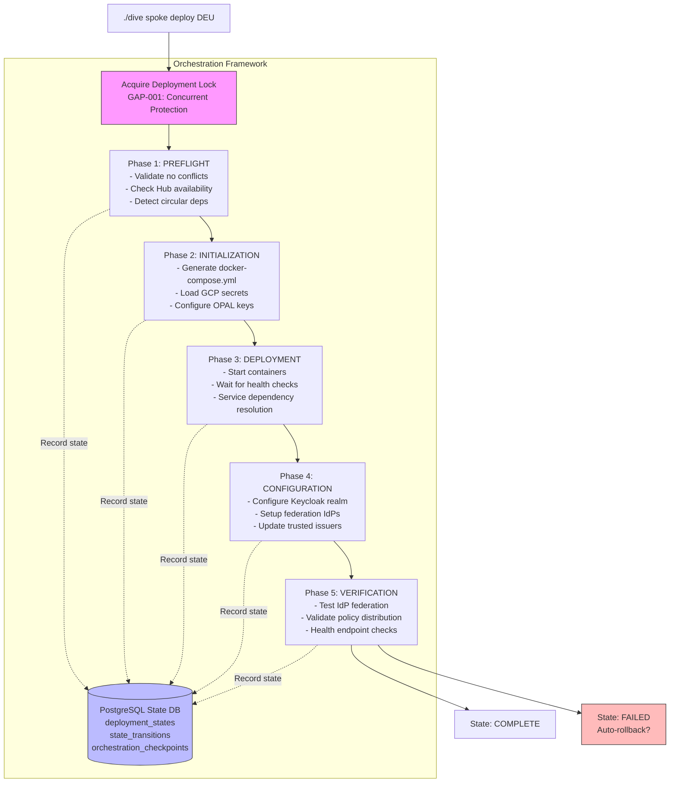

# DIVE V3 Orchestration Architecture - Comprehensive Review & Remediation

## 🎯 MISSION CRITICAL

Conduct a **full architectural review** of DIVE V3's orchestration logic with focus on:
- **State management** (PostgreSQL-backed orchestration state)
- **Error handling** (circuit breakers, retry logic, error recovery)
- **Service dependencies** (startup order, health checks, timeouts)
- **Concurrency control** (deployment locks, race conditions)
- **Federation synchronization** (Keycloak ↔ MongoDB ↔ Docker state consistency)

## 📋 PROJECT CONTEXT

### What is DIVE V3?

**DIVE V3** (Data-In-Virtual-Environment) is a coalition-friendly ICAM web application demonstrating **federated identity management** across USA/NATO partners with policy-driven ABAC authorization.

**Core Architecture:**
```
┌────────────────────────────────────────────────────────────────────┐
│                         DIVE V3 ARCHITECTURE                        │
├────────────────────────────────────────────────────────────────────┤
│                                                                     │
│  ┌─────────────┐         ┌──────────────────────────────┐         │
│  │   HUB       │◄────────┤  SPOKES (Partner Nations)    │         │
│  │  (USA)      │         │  - DEU (Germany)              │         │
│  │             │         │  - FRA (France)               │         │
│  │ Components: │────────►│  - GBR (United Kingdom)       │         │
│  │ - Postgres  │         │  - NLD (Netherlands)          │         │
│  │ - MongoDB   │         │  - etc. (32 NATO partners)    │         │
│  │ - OPAL      │         └──────────────────────────────┘         │
│  │ - Redis     │                                                   │
│  └─────────────┘         Each Spoke:                               │
│                          - Keycloak (IdP broker)                   │
│                          - Backend API (PEP)                       │
│                          - Frontend (Next.js)                      │
│                          - OPA (PDP)                               │
│                          - MongoDB (resource metadata)             │
│                                                                     │
└────────────────────────────────────────────────────────────────────┘
```

### Tech Stack
- **Orchestration**: Bash (DIVE CLI), PostgreSQL (state management)
- **Frontend**: Next.js 15+, NextAuth.js v5, TypeScript
- **Backend**: Node.js 20+, Express.js 4.18, TypeScript
- **Auth**: Keycloak (IdP broker), JWT (RS256)
- **Policy**: OPA (Open Policy Agent), Rego policies
- **Databases**: PostgreSQL (Keycloak + orchestration), MongoDB (resources + federation state)
- **Infrastructure**: Docker Compose, Terraform
- **Distribution**: OPAL (policy distribution to spokes)

### Critical Deployment Workflow



## 📁 PROJECT STRUCTURE (CRITICAL FILES ONLY)

```
DIVE-V3/
├── scripts/
│   └── dive-modules/
│       ├── orchestration-framework.sh         # ⚠️ SERVICE DEPENDENCIES, CIRCUIT BREAKERS, HEALTH CHECKS
│       ├── orchestration-state-db.sh          # ⚠️ POSTGRESQL STATE MANAGEMENT, DUAL-WRITE LOGIC
│       ├── orchestration-dependencies.sh      # Service dependency graph
│       ├── error-recovery.sh                  # Circuit breaker, retry patterns
│       ├── deployment-state.sh                # File-based state (legacy fallback)
│       ├── orchestration-state-recovery.sh    # State consistency validation
│       ├── federation-state-db.sh             # Federation state in MongoDB
│       ├── lock-cleanup.sh                    # Stale lock cleanup
│       │
│       ├── hub/
│       │   ├── services.sh                    # Hub service management
│       │   ├── init.sh                        # Hub initialization
│       │   └── deployment.sh                  # Hub deployment logic
│       │
│       └── spoke/
│           ├── spoke-deploy.sh                # Spoke deployment entry point
│           └── pipeline/
│               ├── spoke-pipeline.sh          # ⚠️ PIPELINE CONTROLLER (MAIN ORCHESTRATION)
│               ├── phase-preflight.sh         # ⚠️ CONFLICT DETECTION, HUB VALIDATION
│               ├── phase-initialization.sh    # Secret loading, compose generation
│               ├── phase-deployment.sh        # ⚠️ CONTAINER STARTUP, HEALTH CHECKS
│               ├── phase-configuration.sh     # Keycloak realm setup, federation
│               ├── phase-verification.sh      # End-to-end health validation
│               ├── spoke-containers.sh        # Container management utilities
│               ├── spoke-secrets.sh           # GCP Secret Manager integration
│               ├── spoke-federation.sh        # Federation IdP configuration
│               └── spoke-error-codes.sh       # Error taxonomy
│
├── backend/src/
│   ├── services/
│   │   ├── hub-spoke-registry.service.ts     # ⚠️ FEDERATION STATE (MONGODB)
│   │   └── opal-cdc.service.ts               # Policy distribution
│   │
│   ├── routes/
│   │   └── public.routes.ts                  # /api/idps/public (federation IdP list)
│   │
│   └── scripts/
│       ├── audit-federation-divergence.ts    # Detect Keycloak vs MongoDB drift
│       └── clean-stale-idps.ts               # Remove orphaned Keycloak IdPs
│
├── docker-compose.hub.yml                     # Hub infrastructure
├── instances/                                 # Per-spoke config (DEU, FRA, GBR, etc.)
└── docs/federation/README.md                  # Federation architecture docs
```

## 🔍 KNOWN ARCHITECTURAL ISSUES (FROM CODE ANALYSIS)

### Issue Category: State Management

**GAP: Dual-Write Complexity**
- **Location**: `orchestration-state-db.sh:140-220`
- **Problem**: Writes to both file (.dive-state/) and PostgreSQL, prone to inconsistency
- **Evidence**: Multiple CRITICAL FIX comments about moving to DB-only mode
- **Impact**: State divergence between file and database during failures

**GAP: Checkpoint System Complexity**
- **Location**: `orchestration-framework.sh:1256-1633`
- **Problem**: Originally dual-stored (file + DB), now DB-only, but rollback logic incomplete
- **Evidence**: "CRITICAL SIMPLIFICATION (2026-01-15): Database-only checkpoints"
- **Impact**: Rollback functionality may not work correctly

### Issue Category: Concurrency Control

**GAP-001: Deployment Lock Race Conditions** ✅ PARTIALLY FIXED
- **Location**: `orchestration-framework.sh:284-472`
- **Problem**: File-based locks can be orphaned, PostgreSQL advisory locks added but fallback is complex
- **Evidence**: Dual lock mechanism (file + database), unclear precedence
- **Impact**: Concurrent deployments may corrupt state

### Issue Category: Service Dependencies

**GAP-005: Circular Dependency Detection** ✅ FIXED
- **Location**: `orchestration-framework.sh:77-230`
- **Problem**: Service dependency graph validation
- **Evidence**: `orch_detect_circular_dependencies()` function
- **Impact**: Prevents invalid service configurations

**GAP-002: Keycloak Timeout Tuning** ✅ FIXED
- **Location**: `orchestration-framework.sh:233-245`
- **Problem**: Keycloak timeout increased 180→240s for P99 startup
- **Evidence**: "P99 startup time is 150s, need 50%+ margin"
- **Impact**: Reduced false-positive timeout failures

**GAP-007: Health Check Standardization** ✅ FIXED
- **Location**: `orchestration-framework.sh:621-836`
- **Problem**: Inconsistent health check methods across services
- **Evidence**: Multi-level health validation (Docker, HTTP, fallback)
- **Impact**: More reliable service startup detection

### Issue Category: Federation State Consistency

**GAP: Three-Layer State Drift**
- **Location**: `backend/src/services/hub-spoke-registry.service.ts`, `docs/federation/README.md:123-174`
- **Problem**: Federation state exists in 3 places: Keycloak IdPs, MongoDB `federation_spokes`, Docker containers
- **Evidence**: MongoDB declared as "source of truth" but validation incomplete
- **Impact**: `/api/idps/public` may show stale/invalid IdPs

```
Layer 1: Keycloak IdPs (can/could connect)  ─┐
Layer 2: MongoDB federation_spokes (should show) ─┼─► Sync issues?
Layer 3: Docker containers (is running?)     ─┘
```

### Issue Category: Error Recovery

**GAP: Circuit Breaker State Persistence**
- **Location**: `orchestration-framework.sh:925-1095`, `orchestration-state-db.sh:488-540`
- **Problem**: Circuit breaker state in memory, lost on script restart
- **Evidence**: Database persistence added but not fully integrated
- **Impact**: Circuit breaker doesn't survive across deployments

**GAP: Retry Logic Context-Awareness**
- **Location**: `orchestration-framework.sh:1097-1182`
- **Problem**: Different operations need different retry strategies, implementation incomplete
- **Evidence**: `orch_calculate_retry_delay()` has context-aware logic but not all operations use it
- **Impact**: Sub-optimal retry behavior

## 🎯 SCOPE OF ARCHITECTURAL REVIEW

### 1. State Management Deep Dive

**Objectives:**
- [ ] Audit all state transitions (file ↔ database ↔ Docker)
- [ ] Validate dual-write consistency guarantees
- [ ] Review checkpoint/rollback mechanism
- [ ] Identify state corruption scenarios
- [ ] Recommend migration path to DB-only (Phase 3)

**Key Questions:**
1. What happens if database write succeeds but file write fails?
2. How do we recover from partial checkpoint creation?
3. Are state transitions atomic (BEGIN/COMMIT)?
4. What is the rollback strategy if deployment fails mid-phase?

### 2. Error Handling & Recovery Analysis

**Objectives:**
- [ ] Map all error severity levels (CRITICAL, HIGH, MEDIUM, LOW)
- [ ] Validate circuit breaker thresholds
- [ ] Review retry logic for all operations
- [ ] Test error recovery scenarios
- [ ] Document failure modes and mitigations

**Key Questions:**
1. Do circuit breakers correctly prevent cascading failures?
2. Are retry delays appropriate for each operation type?
3. What happens when orchestration database is unavailable?
4. How do we recover from partial federation setup?

### 3. Service Dependency Resolution

**Objectives:**
- [ ] Validate service dependency graph completeness
- [ ] Test parallel vs sequential startup scenarios
- [ ] Review health check timeout calculations
- [ ] Identify dependency deadlock risks
- [ ] Optimize startup ordering for performance

**Key Questions:**
1. Are all service dependencies correctly declared?
2. Do health checks reliably detect service readiness?
3. Can services start in parallel where possible?
4. What happens if a dependency fails health check?

### 4. Concurrency & Locking Strategy

**Objectives:**
- [ ] Test concurrent deployment scenarios
- [ ] Validate lock cleanup mechanisms
- [ ] Review lock timeout configurations
- [ ] Identify race condition vulnerabilities
- [ ] Document lock acquisition precedence

**Key Questions:**
1. File lock vs PostgreSQL advisory lock - which takes precedence?
2. How do we clean up stale locks automatically?
3. What happens if a deployment crashes mid-execution?
4. Can we detect and warn about concurrent deployments?

### 5. Federation State Synchronization

**Objectives:**
- [ ] Map all federation state sources
- [ ] Validate MongoDB as source of truth
- [ ] Test Keycloak ↔ MongoDB sync
- [ ] Review Docker container state integration
- [ ] Design audit/reconciliation process

**Key Questions:**
1. How do we detect drift between Keycloak and MongoDB?
2. When should stale Keycloak IdPs be removed?
3. How do we handle spoke de-registration?
4. What is the recovery process for state divergence?

## 📊 GAP ANALYSIS FRAMEWORK

For each identified gap, document:

```markdown
### GAP-XXX: [Descriptive Title]

**Category**: [State Management | Error Handling | Dependencies | Concurrency | Federation]

**Severity**: [CRITICAL | HIGH | MEDIUM | LOW]
- CRITICAL: Blocks deployment, data loss risk, security vulnerability
- HIGH: Causes frequent failures, performance degradation
- MEDIUM: Workaround available, minor impact
- LOW: Nice-to-have, edge case

**Current State**:
- What is the current implementation?
- Where is the code located?
- What was the original intent?

**Problem Description**:
- What specifically is broken/incomplete?
- What scenarios trigger the issue?
- What is the user/system impact?

**Evidence**:
- Code snippets
- Log excerpts
- Test case failures
- Comments (CRITICAL/FIXME/TODO/GAP-)

**Root Cause**:
- Why does this problem exist?
- What architectural decision led to this?
- Are there constraints preventing a fix?

**Proposed Solution**:
- What is the ideal fix?
- Are there alternative approaches?
- What are the tradeoffs?

**Implementation Plan**:
- [ ] Step 1: [Description] (Owner: TBD, Est: X days)
- [ ] Step 2: [Description] (Owner: TBD, Est: X days)
- [ ] ...

**Testing Strategy**:
- Unit tests
- Integration tests
- E2E scenarios
- Regression validation

**Success Criteria**:
- How do we measure fix effectiveness?
- What metrics should improve?
- What acceptance criteria must be met?
```

## 🛠️ PHASED IMPLEMENTATION PLAN

### Phase 1: Foundation & Gap Analysis (Weeks 1-2)

**Goals:**
1. **Document Current State** (SMART: Complete by end of Week 1)
   - Success Metric: 100% of orchestration code paths mapped
   - Deliverable: Architecture diagram (Mermaid) + sequence diagrams

2. **Prioritize Gaps** (SMART: Complete by end of Week 1)
   - Success Metric: All gaps categorized (CRITICAL/HIGH/MEDIUM/LOW)
   - Deliverable: Gap registry with severity scores

3. **Design Solutions** (SMART: Complete by end of Week 2)
   - Success Metric: Each CRITICAL gap has 2+ solution proposals
   - Deliverable: ADR (Architecture Decision Record) for each solution

**Deliverables:**
- [ ] `docs/architecture/orchestration-state-flow.mermaid` - State transition diagram
- [ ] `docs/architecture/service-dependency-graph.mermaid` - Startup order visualization
- [ ] `docs/architecture/error-handling-taxonomy.md` - Error classification
- [ ] `docs/architecture/gap-registry.md` - Prioritized list of issues
- [ ] `docs/architecture/adr/` - Architecture Decision Records

**Testing Strategy:**
- Manual code review + static analysis
- Document all CRITICAL/FIXME/TODO/GAP- comments
- Run existing deployments with verbose logging
- Capture state transitions in database

### Phase 2: State Management Consolidation (Weeks 3-5)

**Goals:**
1. **Eliminate Dual-Write** (SMART: Zero file writes by end of Week 4)
   - Success Metric: All state operations use `orch_db_set_state()` only
   - Deliverable: Database-only state management

2. **Implement Atomic Checkpoints** (SMART: 100% checkpoint success by end of Week 5)
   - Success Metric: No checkpoint corruption in 50 test deployments
   - Deliverable: Transaction-wrapped checkpoint creation

3. **Validate Rollback** (SMART: 100% rollback success by end of Week 5)
   - Success Metric: Rollback works in all failure scenarios
   - Deliverable: Automated rollback tests

**Implementation Steps:**
- [ ] **Step 1**: Create database schema migration
  - Owner: TBD
  - Estimate: 2 days
  - Deliverable: `migrations/002_state_consolidation.sql`

- [ ] **Step 2**: Refactor `orch_db_set_state()` to DB-only
  - Owner: TBD
  - Estimate: 3 days
  - Deliverable: Remove all `.dive-state/*.state` file writes

- [ ] **Step 3**: Implement atomic checkpoint creation
  - Owner: TBD
  - Estimate: 3 days
  - Deliverable: `orch_create_checkpoint()` uses database transactions

- [ ] **Step 4**: Rewrite rollback logic
  - Owner: TBD
  - Estimate: 5 days
  - Deliverable: `orch_execute_rollback()` restores from database

- [ ] **Step 5**: Migrate existing state files to database
  - Owner: TBD
  - Estimate: 2 days
  - Deliverable: `scripts/migrate-state-to-db.sh`

**Testing Strategy:**
```bash
# Test 1: State persistence
./dive spoke deploy DEU
# Kill deployment mid-flight (Ctrl+C)
# Validate database shows "DEPLOYMENT" state
# Restart deployment
# Validate rollback to "INITIALIZING" or "FAILED"

# Test 2: Checkpoint creation
./dive spoke deploy FRA
# Checkpoint after each phase
# Validate database has checkpoint records
# Test rollback to each checkpoint

# Test 3: Concurrent deployment protection
./dive spoke deploy GBR &
./dive spoke deploy GBR &
# Expect: Second deployment fails with lock error
# Validate: Only one deployment progresses
```

**Success Criteria:**
- ✅ Zero `.dive-state/*.state` file writes
- ✅ All state transitions logged to database
- ✅ Rollback works in 100% of test scenarios
- ✅ No state corruption in 100 consecutive deployments

### Phase 3: Error Handling & Circuit Breakers (Weeks 6-8)

**Goals:**
1. **Persistent Circuit Breakers** (SMART: Circuit state survives restarts by end of Week 7)
   - Success Metric: Circuit breaker state in database, not memory
   - Deliverable: `circuit_breakers` table integration

2. **Context-Aware Retry** (SMART: 50% reduction in retry latency by end of Week 8)
   - Success Metric: Retry delays match operation characteristics
   - Deliverable: Retry strategy matrix (operation → delay calculation)

3. **Automated Recovery** (SMART: 80% of transient failures auto-recover by end of Week 8)
   - Success Metric: Circuit breakers prevent cascading failures
   - Deliverable: Recovery playbooks for common failures

**Implementation Steps:**
- [ ] **Step 1**: Integrate circuit breaker with database
  - Owner: TBD
  - Estimate: 3 days
  - Deliverable: `orch_record_circuit_failure()` writes to database

- [ ] **Step 2**: Implement retry strategy matrix
  - Owner: TBD
  - Estimate: 3 days
  - Deliverable: `orch_calculate_retry_delay()` uses operation-specific logic

- [ ] **Step 3**: Add circuit breaker metrics
  - Owner: TBD
  - Estimate: 2 days
  - Deliverable: Grafana dashboard for circuit breaker state

- [ ] **Step 4**: Create automated recovery actions
  - Owner: TBD
  - Estimate: 5 days
  - Deliverable: `error-recovery.sh` auto-executes remediation

**Testing Strategy:**
```bash
# Test 1: Circuit breaker persistence
# Start deployment, trigger 3 consecutive Keycloak failures
# Validate circuit breaker opens
# Restart deployment script
# Validate circuit breaker still open (from database)

# Test 2: Retry strategy
# Mock Keycloak slow startup (150s)
# Validate retry delay increases progressively
# Mock federation failure (permanent)
# Validate retry delay has jitter, not exponential

# Test 3: Automated recovery
# Trigger known failure (e.g., missing secret)
# Validate error-recovery.sh auto-fixes
# Deployment continues without manual intervention
```

**Success Criteria:**
- ✅ Circuit breaker state persists across script restarts
- ✅ Retry delays appropriate for each operation type
- ✅ 80% of transient failures recover automatically
- ✅ Zero cascading failures in test scenarios

### Phase 4: Service Dependencies & Health Checks (Weeks 9-11)

**Goals:**
1. **Dynamic Timeout Calculation** (SMART: Zero false-positive timeouts by end of Week 10)
   - Success Metric: Timeouts based on P95 historical startup times
   - Deliverable: `orch_calculate_dynamic_timeout()` fully implemented

2. **Parallel Service Startup** (SMART: 30% reduction in total startup time by end of Week 11)
   - Success Metric: Services at same dependency level start in parallel
   - Deliverable: Dependency-level batching

3. **Comprehensive Health Validation** (SMART: 100% health check coverage by end of Week 11)
   - Success Metric: All services have multi-level health checks
   - Deliverable: Health check matrix (service → Docker/HTTP/custom)

**Implementation Steps:**
- [ ] **Step 1**: Implement dynamic timeout calculation
  - Owner: TBD
  - Estimate: 4 days
  - Deliverable: Query `deployment_steps` for P95, adjust timeouts

- [ ] **Step 2**: Parallelize service startup
  - Owner: TBD
  - Estimate: 5 days
  - Deliverable: Start services by dependency level, not serially

- [ ] **Step 3**: Add custom health checks
  - Owner: TBD
  - Estimate: 3 days
  - Deliverable: Keycloak realm check, MongoDB federation_spokes check

- [ ] **Step 4**: Optimize dependency graph
  - Owner: TBD
  - Estimate: 2 days
  - Deliverable: Remove unnecessary dependencies

**Testing Strategy:**
```bash
# Test 1: Dynamic timeout
# Deploy spoke 20 times
# Capture Keycloak startup times
# Validate timeout adjusts to P95 + 50%

# Test 2: Parallel startup
# Measure baseline deployment time
# Implement parallel startup
# Validate 30%+ reduction

# Test 3: Health check robustness
# Start spoke with intentional misconfigurations
# Validate health checks detect issues
# No false positives
```

**Success Criteria:**
- ✅ Zero false-positive timeout failures
- ✅ 30% reduction in total deployment time
- ✅ 100% health check coverage for all services
- ✅ Dependency graph visualized and validated

### Phase 5: Federation State Consistency (Weeks 12-14)

**Goals:**
1. **MongoDB as Single Source of Truth** (SMART: Zero state drift by end of Week 13)
   - Success Metric: `federation_spokes` drives all IdP visibility
   - Deliverable: `/api/idps/public` reads only from MongoDB

2. **Automated Drift Detection** (SMART: Daily audit reports by end of Week 14)
   - Success Metric: Detect Keycloak ↔ MongoDB divergence
   - Deliverable: `audit-federation-state.sh` runs in cron

3. **Stale IdP Cleanup** (SMART: Zero orphaned IdPs by end of Week 14)
   - Success Metric: `clean-stale-idps.ts` removes Keycloak IdPs without active spokes
   - Deliverable: Weekly cleanup job

**Implementation Steps:**
- [ ] **Step 1**: Refactor `/api/idps/public` to MongoDB-first
  - Owner: TBD
  - Estimate: 2 days
  - Deliverable: `public.routes.ts` queries `federation_spokes` collection

- [ ] **Step 2**: Implement drift detection
  - Owner: TBD
  - Estimate: 3 days
  - Deliverable: `audit-federation-divergence.ts` generates report

- [ ] **Step 3**: Automated cleanup
  - Owner: TBD
  - Estimate: 2 days
  - Deliverable: `clean-stale-idps.ts` runs weekly

- [ ] **Step 4**: Add reconciliation UI
  - Owner: TBD
  - Estimate: 5 days
  - Deliverable: Admin dashboard shows drift, allows manual reconciliation

**Testing Strategy:**
```bash
# Test 1: MongoDB source of truth
# Register spoke DEU (adds to federation_spokes)
# Validate /api/idps/public shows deu-idp
# Unregister spoke DEU (removes from federation_spokes)
# Validate /api/idps/public hides deu-idp

# Test 2: Drift detection
# Manually create Keycloak IdP without MongoDB entry
# Run audit-federation-divergence.ts
# Validate report shows orphaned IdP

# Test 3: Automated cleanup
# Create 10 orphaned Keycloak IdPs
# Run clean-stale-idps.ts
# Validate all orphaned IdPs removed
```

**Success Criteria:**
- ✅ `/api/idps/public` shows only active spokes (from MongoDB)
- ✅ Daily drift detection reports generated
- ✅ Weekly automated cleanup removes stale IdPs
- ✅ Admin UI shows state across all 3 layers

### Phase 6: Testing & Validation (Weeks 15-16)

**Goals:**
1. **Comprehensive Test Suite** (SMART: 100 E2E test scenarios by end of Week 16)
   - Success Metric: All critical paths covered
   - Deliverable: `tests/orchestration/` directory

2. **Chaos Engineering** (SMART: System survives 20 failure scenarios)
   - Success Metric: Resilience to network failures, OOM, disk full
   - Deliverable: Chaos testing framework

3. **Performance Benchmarking** (SMART: Baseline metrics established)
   - Success Metric: Deployment time, error rate, resource usage
   - Deliverable: Grafana dashboards + alerting

**Test Scenarios:**
```bash
# E2E Test Matrix (100 scenarios)

# 1. Happy Path (10 scenarios)
- Deploy new spoke (DEU, FRA, GBR, ...)
- Redeploy existing spoke
- Scale up/down containers
- Federation with 2, 5, 10 partners
- Hub + 1 spoke, Hub + 32 spokes

# 2. Failure Modes (30 scenarios)
- Keycloak startup timeout
- PostgreSQL unavailable
- MongoDB connection failure
- GCP Secret Manager unavailable
- Docker daemon crash
- Network partition (hub ↔ spoke)
- Out of disk space
- Out of memory
- DNS resolution failure
- Certificate expiration

# 3. Concurrency (10 scenarios)
- Deploy 2 spokes simultaneously
- Deploy same spoke twice (should fail)
- Hub restart during spoke deployment
- Database failover mid-deployment
- Lock timeout and recovery

# 4. State Management (20 scenarios)
- Deployment interrupted (Ctrl+C)
- Database write fails, file succeeds
- Checkpoint creation failure
- Rollback to each phase
- State corruption recovery

# 5. Federation (15 scenarios)
- Register new spoke
- Unregister spoke
- Update federation trust
- Keycloak ↔ MongoDB drift
- Stale IdP cleanup

# 6. Error Recovery (15 scenarios)
- Circuit breaker opens
- Automated retry succeeds
- Manual intervention required
- Error threshold exceeded
- Recovery from each error code
```

**Success Criteria:**
- ✅ 100 E2E test scenarios pass
- ✅ System survives 20 chaos scenarios
- ✅ Performance metrics baseline established
- ✅ Regression test suite automated (CI/CD)

## 🚨 CRITICAL CONSTRAINTS

### 1. DIVE CLI Mandate
**ABSOLUTE REQUIREMENT**: Use `./dive` CLI for ALL orchestration operations.

```bash
# ✅ ALLOWED
./dive hub up
./dive spoke deploy DEU
./dive spoke down FRA
./dive spoke status

# ❌ FORBIDDEN
docker compose -f docker-compose.hub.yml up
docker exec dive-spoke-deu-keycloak /opt/keycloak/bin/kcadm.sh ...
docker network create dive-shared
```

**Why**: The DIVE CLI is the orchestration framework. It handles:
- State management (database writes)
- Lock acquisition
- Error handling
- Logging
- Checkpointing

Bypassing the CLI risks:
- State corruption
- Concurrent deployment conflicts
- Orphaned resources
- Lost audit trail

### 2. Dummy Data Authorization
All test users and data are FAKE. You are **authorized to**:
- Nuke any Docker container
- Drop database tables
- Delete MongoDB collections
- Wipe state files
- Test destructive operations

**Why**: Testing "clean slate" scenarios requires aggressive cleanup.

### 3. Best Practices Only
**NO WORKAROUNDS. NO SHORTCUTS.**

```bash
# ❌ BAD: Quick fix
echo "INITIALIZING" > .dive-state/deu.state

# ✅ GOOD: Persistent solution
# Implement transaction-wrapped state updates
orch_db_set_state "DEU" "INITIALIZING" "" "{\"reason\":\"proper fix\"}"
```

**Why**: This is production-grade infrastructure. Hacks accumulate technical debt.

### 4. Resilient, Persistent Solutions
All solutions must be:
- **Idempotent**: Re-running produces same result
- **Atomic**: All-or-nothing operations
- **Persistent**: Survives script restarts
- **Testable**: Automated validation
- **Observable**: Logs, metrics, alerts

### 5. Full Testing Suite
Every fix must include:
- **Unit tests**: Individual function validation
- **Integration tests**: Multi-component interaction
- **E2E tests**: Full deployment scenario
- **Regression tests**: Prevent reintroduction of bugs

## 📝 DELIVERABLES CHECKLIST

### Documentation
- [ ] `docs/architecture/orchestration-review.md` - Full architectural review
- [ ] `docs/architecture/gap-registry.md` - Prioritized gap list
- [ ] `docs/architecture/adr/` - Architecture Decision Records
- [ ] `docs/architecture/state-flow.mermaid` - State transition diagram
- [ ] `docs/architecture/dependency-graph.mermaid` - Service startup visualization
- [ ] `docs/architecture/error-taxonomy.md` - Error handling classification
- [ ] `docs/architecture/testing-strategy.md` - Test plan and scenarios

### Code Changes
- [ ] `orchestration-state-db.sh` - DB-only state management
- [ ] `orchestration-framework.sh` - Consolidated error handling
- [ ] `spoke-pipeline.sh` - Optimized phase execution
- [ ] `error-recovery.sh` - Automated remediation
- [ ] `federation-state-db.sh` - MongoDB source of truth

### Testing
- [ ] `tests/orchestration/state-management.test.sh` - State transition tests
- [ ] `tests/orchestration/concurrency.test.sh` - Lock and race condition tests
- [ ] `tests/orchestration/error-recovery.test.sh` - Circuit breaker tests
- [ ] `tests/orchestration/federation-sync.test.sh` - Federation state tests
- [ ] `tests/orchestration/e2e-deployment.test.sh` - Full deployment scenarios

### Monitoring
- [ ] `monitoring/grafana/orchestration-dashboard.json` - Deployment metrics
- [ ] `monitoring/prometheus/orchestration-rules.yml` - Alerting rules
- [ ] `scripts/audit-orchestration-state.sh` - State consistency checks

## 🎯 SUCCESS CRITERIA (SMART GOALS)

| Goal | Metric | Target | Measurement |
|------|--------|--------|-------------|
| **State Consistency** | State drift incidents | Zero per month | Database vs file comparison |
| **Deployment Reliability** | Successful deployments | 99% | Success / Total deployments |
| **Error Recovery** | Auto-recovered failures | 80% | Recovered / Total failures |
| **Concurrent Safety** | Lock acquisition failures | Zero race conditions | Concurrent deployment tests |
| **Federation Accuracy** | Stale IdP count | Zero | `/api/idps/public` vs MongoDB |
| **Deployment Speed** | Total deployment time | 30% reduction | Baseline vs optimized |
| **Health Check Accuracy** | False-positive timeouts | Zero per week | Timeout events / Actual failures |
| **Circuit Breaker Effectiveness** | Cascading failures prevented | 100% | Failures contained / Total |

## 🔗 REFERENCES

### Key Documentation
- **Federation Architecture**: `docs/federation/README.md`
- **Orchestration Framework**: `scripts/dive-modules/orchestration-framework.sh`
- **State Management**: `scripts/dive-modules/orchestration-state-db.sh`
- **Deployment Pipeline**: `scripts/dive-modules/spoke/pipeline/spoke-pipeline.sh`
- **Error Codes**: `scripts/dive-modules/spoke/pipeline/spoke-error-codes.sh`

### Related Issues
- GAP-001: Concurrent deployment protection
- GAP-002: Keycloak timeout tuning
- GAP-005: Circular dependency detection
- GAP-007: Standardized health checks

### Database Schema
- **State Management**: `backend/migrations/001_orchestration_state_db.sql`
- **Federation State**: `backend/src/models/federation-spoke.model.ts`

---

## 🚀 GETTING STARTED

### Pre-Review Checklist
1. [ ] Read this entire document (don't skip sections)
2. [ ] Clone the repository
3. [ ] Run `./dive hub up` to start hub infrastructure
4. [ ] Deploy a test spoke: `./dive spoke deploy DEU`
5. [ ] Review logs in `logs/orchestration-*.log`
6. [ ] Examine database state: `docker exec dive-hub-postgres psql -U postgres -d orchestration`
7. [ ] Map existing state files: `ls -lah .dive-state/`

### Initial Analysis Commands
```bash
# 1. Map all state locations
find . -name "*.state" -type f
docker exec dive-hub-postgres psql -U postgres -d orchestration -c "SELECT * FROM deployment_states ORDER BY timestamp DESC LIMIT 10;"

# 2. Identify all CRITICAL/FIXME/TODO comments
rg "CRITICAL|FIXME|TODO|GAP-" scripts/dive-modules/ --type sh

# 3. Test concurrent deployment protection
./dive spoke deploy DEU &
./dive spoke deploy DEU &
# Expect: Second deployment fails with lock error

# 4. Test state persistence
./dive spoke deploy FRA
# Ctrl+C mid-deployment
docker exec dive-hub-postgres psql -U postgres -d orchestration -c "SELECT * FROM deployment_states WHERE instance_code='fra';"
# Validate state recorded correctly

# 5. Test federation state
./dive spoke register GBR
docker exec dive-hub-mongo mongo dive_v3 --eval "db.federation_spokes.find({spoke_code: 'GBR'}).pretty()"
curl -s http://localhost:4000/api/idps/public | jq '.[] | select(.alias | contains("gbr"))'
```

---

**Remember**: This is a production-grade coalition system. Quality over speed. No hacks. Full testing. Best practices only.

**Authorization**: All data is DUMMY. You are cleared to nuke resources for testing.

**Mandate**: Use `./dive` CLI exclusively. No manual Docker commands.

Let's build resilient, persistent, observable orchestration infrastructure. 🚀
