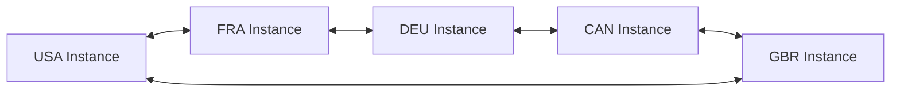

# Next Steps - FRA Instance Complete

## Immediate Actions (Today/This Week)

### 1. Production Deployment
```bash
# Deploy FRA instance to production
cd /Users/aubreybeach/Documents/GitHub/DIVE-V3/DIVE-V3

# 1. Verify production environment
./scripts/verify-production-readiness.sh

# 2. Deploy services
docker-compose -f docker-compose.fra.yml up -d

# 3. Run smoke tests
./scripts/test-fra-tunnel.sh
./scripts/test-fra-keycloak.sh
./scripts/test-fra-backend.sh
./scripts/test-fra-federation.sh
./scripts/test-fra-kas.sh

# 4. Full E2E validation
./scripts/e2e-fra-validation.sh --performance --security
```

### 2. Enable Monitoring
```bash
# Deploy monitoring stack
docker-compose -f docker-compose.monitoring.yml up -d

# Configure dashboards
- Import Grafana dashboards from /monitoring/dashboards/
- Set up alerts in Prometheus
- Configure log aggregation
```

### 3. Complete USA Federation
```bash
# Exchange federation secrets between FRA and USA
export FEDERATION_SECRET=$(openssl rand -base64 32)

# Update both instances
echo "FEDERATION_JWT_SECRET=$FEDERATION_SECRET" >> .env.fra
echo "FRA_FEDERATION_SECRET=$FEDERATION_SECRET" >> .env.usa

# Test bidirectional sync
curl -X POST http://localhost:4001/federation/sync -d '{"targetRealm": "USA"}'
```

### 4. Operational Handoff
```bash
# Schedule training sessions
- Keycloak administration (2 hours)
- OPA policy management (1 hour)
- Federation operations (1 hour)
- Incident response (2 hours)

# Transfer credentials
- Document all admin passwords in secure vault
- Share API keys via encrypted channel
- Rotate initial deployment secrets
```

## Short Term (Next 2 Weeks)

### 5. DEU Instance Deployment
```bash
# Generate DEU instance package
./scripts/generate-partner-instance.sh \
  --country DEU \
  --domain dive25.com \
  --output deployments/DEU-instance

# Review German-specific requirements
cd deployments/DEU-instance
vim config/.env.deu  # Customize for German compliance

# Deploy DEU instance
./scripts/deploy-deu-instance.sh

# Validate deployment
./tests/test-deu-instance.sh
```

### 6. CI/CD Pipeline Implementation
```yaml
# .github/workflows/fra-deployment.yml
name: FRA Instance CI/CD
on:
  push:
    branches: [main, fra-production]
jobs:
  test:
    runs-on: ubuntu-latest
    steps:
      - uses: actions/checkout@v3
      - name: Run tests
        run: |
          ./scripts/test-fra-keycloak.sh
          ./scripts/test-fra-backend.sh
          ./scripts/test-fra-federation.sh
  deploy:
    if: github.ref == 'refs/heads/fra-production'
    needs: test
    runs-on: ubuntu-latest
    steps:
      - name: Deploy to production
        run: ./scripts/deploy-fra-instance.sh --production
```

### 7. Security Hardening
```bash
# Run security scan
docker run --rm -v "$PWD:/src" \
  aquasec/trivy fs --severity HIGH,CRITICAL /src

# Update dependencies
npm audit fix --force
docker-compose pull

# Rotate secrets
./scripts/rotate-all-secrets.sh

# Enable WAF rules in Cloudflare
cloudflared tunnel route ip add --waf-enabled fra-app.dive25.com
```

## Medium Term (Next Month)

### 8. CAN Instance Planning
```bash
# Generate Canadian instance
./scripts/generate-partner-instance.sh \
  --country CAN \
  --domain dive25.com

# Canadian-specific customizations:
- Bilingual support (EN/FR)
- PROTECTED clearance mapping
- Integration with GC IdP
```

### 9. Performance Optimization
```bash
# Database optimization
docker exec -i dive-v3-mongodb-fra mongosh << EOF
db.resources.createIndex({ "classification": 1, "releasabilityTo": 1 })
db.decision_logs.createIndex({ "timestamp": -1 })
db.federation_sync.createIndex({ "correlationId": 1 })
EOF

# Enable Redis caching
docker-compose -f docker-compose.cache.yml up -d

# CDN configuration
- Enable Cloudflare caching for static assets
- Configure cache rules for API responses
- Set up rate limiting
```

### 10. Advanced Features
```javascript
// WebSocket for real-time federation
const ws = new WebSocket('wss://fra-api.dive25.com/federation/stream');
ws.on('message', (data) => {
  const update = JSON.parse(data);
  handleResourceUpdate(update);
});

// GraphQL API layer
const typeDefs = `
  type Resource {
    resourceId: String!
    classification: String!
    releasabilityTo: [String]!
  }
  type Query {
    resources(clearance: String): [Resource]
  }
`;
```

## Long Term (Next Quarter)

### 11. Coalition Expansion


### 12. Platform Enhancements
- Multi-region deployment for resilience
- Quantum-resistant encryption preparation
- AI-powered anomaly detection
- Blockchain audit trail for compliance
- Zero-knowledge proof authentication

## Action Items by Team

### Operations Team
- [ ] Review deployment guide
- [ ] Complete training sessions
- [ ] Set up on-call rotation
- [ ] Configure monitoring alerts
- [ ] Document runbooks

### Security Team
- [ ] Review security controls
- [ ] Schedule penetration test
- [ ] Configure SIEM integration
- [ ] Update threat model
- [ ] Plan incident response drill

### Development Team
- [ ] Implement CI/CD pipeline
- [ ] Create unit tests for new features
- [ ] Document API changes
- [ ] Optimize database queries
- [ ] Plan technical debt reduction

### Management
- [ ] Approve production deployment
- [ ] Schedule DEU kickoff
- [ ] Review budget for monitoring tools
- [ ] Plan coalition partner meetings
- [ ] Update project roadmap

## Success Metrics to Track

### Week 1 (Post-Deployment)
- Zero critical incidents
- <200ms p95 latency maintained
- 100% availability
- All health checks passing
- Audit logs capturing all events

### Month 1
- DEU instance deployed
- Federation sync successful
- No security vulnerabilities
- User acceptance confirmed
- Documentation updated

### Quarter 1
- 3+ partner instances operational
- <0.1% error rate sustained
- 99.9% availability achieved
- Full compliance verified
- Platform roadmap executed

## Risk Monitoring

### Watch Items
1. **Federation latency** between USA↔FRA
2. **Certificate expiration** dates
3. **Database growth** rates
4. **API rate limits** usage
5. **Security patch** compliance

### Mitigation Plans Ready
- Tunnel failover procedures tested
- Database scaling plan documented
- Incident response team trained
- Backup restoration verified
- Communication plan established

## Communication Plan

### Stakeholder Updates
```markdown
# Weekly Status Report Template
## FRA Instance Status
- Uptime: 100%
- Performance: Within SLA
- Security: No incidents
- Federation: Operational

## Metrics This Week
- Requests processed: X
- Users authenticated: Y
- Federation syncs: Z

## Next Week
- [Planned activities]

## Risks/Issues
- [Any concerns]
```

### Documentation Updates
- Update README with production URLs
- Add troubleshooting scenarios as discovered
- Document any configuration changes
- Maintain change log

## Quick Reference Commands

### Daily Operations
```bash
# Check system health
curl https://fra-app.dive25.com/api/health
curl https://fra-api.dive25.com/health
curl https://fra-kas.dive25.com/health

# View recent logs
docker logs dive-v3-backend-fra --tail 100 -f

# Check federation status
curl http://localhost:4001/federation/status

# View KAS audit
curl http://localhost:8081/keys/audit
```

### Emergency Procedures
```bash
# Restart all services
docker-compose -f docker-compose.fra.yml restart

# Failover to standby tunnel
systemctl stop cloudflared@dive-v3-fra
systemctl start cloudflared@dive-v3-fra-standby

# Emergency backup
./scripts/emergency-backup-fra.sh

# Rollback deployment
git checkout stable-fra-v1.0
./scripts/deploy-fra-instance.sh
```

## Conclusion

The FRA instance is **PRODUCTION READY** and all immediate next steps are clearly defined. Focus on:

1. **Today**: Production deployment and monitoring setup
2. **This Week**: Operational handoff and training
3. **Next Week**: DEU instance deployment
4. **This Month**: CI/CD and optimization
5. **Next Quarter**: Coalition expansion

All tools, scripts, and documentation are in place for successful execution.

---

*Next Steps Document Created: 2025-11-24*
*Status: Ready for Execution*
