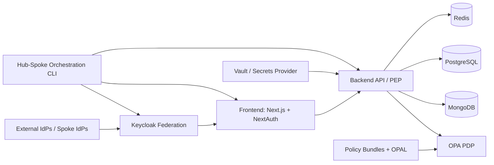

# DIVE V3

Distributed Identity and Verification Engine for coalition-style ICAM, federated trust, and policy-driven access control.

[](https://github.com/albeach/DIVE-V3/actions/workflows/ci-comprehensive.yml)
[](https://github.com/albeach/DIVE-V3/actions/workflows/test-e2e.yml)
[](https://github.com/albeach/DIVE-V3/actions/workflows/security.yml)
[](https://github.com/albeach/DIVE-V3/actions/workflows/codeql.yml)
[](https://github.com/albeach/DIVE-V3/commits/main)
[](https://github.com/albeach/DIVE-V3/issues)
[](https://github.com/albeach/DIVE-V3/stargazers)
[](https://nodejs.org/)

## Table of Contents

- [Why DIVE V3](#why-dive-v3)
- [Architecture at a Glance](#architecture-at-a-glance)
- [Tech Stack](#tech-stack)
- [Quick Start](#quick-start)
- [CLI Cheat Sheet](#cli-cheat-sheet)
- [Repository Layout](#repository-layout)
- [Development and Testing](#development-and-testing)
- [Security Model](#security-model)
- [CI/CD and Automation](#cicd-and-automation)
- [Documentation](#documentation)
- [Contributing](#contributing)
- [Project Status](#project-status)

## Why DIVE V3

DIVE V3 is a hub-spoke federation platform for secure identity and authorization workflows across independent domains. It combines:

- Federated identity with Keycloak across hub and spoke instances.
- ABAC authorization with OPA/OPAL and signed policy bundle workflows.
- Deployment orchestration through a unified `./dive` CLI.
- Multi-service runtime with Next.js frontend, Express backend, and data/control-plane services.
- Operator tooling for diagnostics, federation verification, policy lifecycle, and environment management.

## Architecture at a Glance



## Tech Stack

- Frontend: Next.js, React, TypeScript, Tailwind, Framer Motion
- Backend: Node.js, Express, TypeScript, MongoDB, PostgreSQL, Redis
- Identity and Authorization: Keycloak, OPA, OPAL, JWT (RS256)
- Infra and Ops: Docker Compose, Terraform, Vault, Cloudflare tooling
- Testing and Quality: Jest, Playwright, OPA tests, shell test framework, GitHub Actions

## Quick Start

### Prerequisites

- Docker + Docker Compose v2
- Node.js 20+ and npm 10+
- Bash, `jq`, `curl`, and `git`

### 1) Clone and bootstrap

```bash
git clone https://github.com/albeach/DIVE-V3.git
cd DIVE-V3
./dive setup
```

### 2) Deploy hub

```bash
./dive hub deploy
./dive hub status
```

### 3) Deploy a spoke

```bash
./dive spoke deploy FRA
./dive spoke status FRA
```

### 4) Federate and verify

```bash
./dive spoke federate FRA --auth-code <UUID>
./dive federation verify FRA
./dive federation status
```

### 5) Validate core endpoints (typical local)

- Frontend: `https://localhost:3000`
- Backend health: `https://localhost:4000/health`
- Hub Keycloak: `https://localhost:8443`

Use `./dive hub status` and `./dive spoke status <CODE>` as the source of truth for your active ports and services.

## CLI Cheat Sheet

```bash
# Hub lifecycle
./dive hub deploy
./dive hub up
./dive hub down
./dive hub verify
./dive hub logs

# Spoke lifecycle
./dive spoke deploy <CODE>
./dive spoke up <CODE>
./dive spoke down <CODE>
./dive spoke verify <CODE>
./dive spoke logs <CODE>

# Federation
./dive federation link <CODE>
./dive federation unlink <CODE>
./dive federation verify <CODE>
./dive federation status

# Policy
./dive policy build --sign
./dive policy push
./dive policy test
./dive policy status

# Config and recovery
./dive config show
./dive config validate
./dive orch-db status
./dive nuke --confirm
```

## Repository Layout

```text
.
├── backend/              # Express API, controllers, services, models, scripts
├── frontend/             # Next.js app router UI + admin APIs
├── policies/             # OPA Rego policies and policy tooling
├── scripts/              # DIVE CLI modules, automation, operational scripts
├── instances/            # Hub/spoke instance configs
├── keycloak/             # Realms, themes, mappers, profile templates
├── monitoring/           # Prometheus, Grafana, alerting configuration
├── terraform/            # IaC modules and deployment infrastructure
├── docs/                 # Operational, architecture, and API documentation
└── docker-compose*.yml   # Runtime stack definitions
```

## Development and Testing

### Local development

```bash
# Backend
cd backend
npm ci
npm run dev

# Frontend
cd ../frontend
npm ci
npm run dev
```

### Core test commands

```bash
# Shell tests for CLI/modules
./scripts/tests/run-shell-tests.sh

# Backend unit/integration
cd backend
npm test
npm run test:unit
npm run test:integration

# Frontend unit/e2e
cd ../frontend
npm test
npm run test:e2e

# OPA policy suite
cd ../policies
opa test . -v
```

## Security Model

- Default-deny ABAC evaluation in OPA with explicit allow conditions.
- Identity brokering and federation through Keycloak realms and mappers.
- Secrets-first operation model with Vault as default provider (`SECRETS_PROVIDER=vault`).
- Continuous security scanning in CI (CodeQL, dependency scanning, secret scanning, container scanning).
- Auditable federation and policy operations with diagnostics and verification flows in CLI modules.

## CI/CD and Automation

Primary workflow pipelines:

- `CI - Comprehensive Test Suite` (`.github/workflows/ci-comprehensive.yml`)
- `E2E Tests` (`.github/workflows/test-e2e.yml`)
- `Security Scanning` (`.github/workflows/security.yml`)
- `CodeQL Analysis` (`.github/workflows/codeql.yml`)
- Deployment and packaging workflows under `.github/workflows/`

Open GitHub Actions runs:

- https://github.com/albeach/DIVE-V3/actions

## Documentation

Start here:

- Full docs index: [`docs/README.md`](docs/README.md)
- CLI modules reference: [`scripts/dive-modules/README.md`](scripts/dive-modules/README.md)
- Architecture docs: [`docs/architecture/README.md`](docs/architecture/README.md)
- OpenAPI spec (SP registry): [`docs/api/sp-registry-openapi.yaml`](docs/api/sp-registry-openapi.yaml)
- Postman collection docs: [`docs/postman/README.md`](docs/postman/README.md)

## Contributing

1. Create a feature branch from `main`.
2. Make targeted changes with tests.
3. Run local checks (shell, backend, frontend, policy tests as applicable).
4. Open a PR and ensure GitHub Actions are green.
5. Include docs updates for any behavior or interface change.

Issue tracker:

- https://github.com/albeach/DIVE-V3/issues

## Project Status

- Status: Active development
- Runtime target: Hub-spoke federation with policy-driven authorization
- Language/runtime baseline: Node.js 20+, npm 10+
- Package license declaration: MIT (see `package.json`, `backend/package.json`, `frontend/package.json`)
- Classification intent in project docs: UNCLASSIFIED / public-release demonstration context
