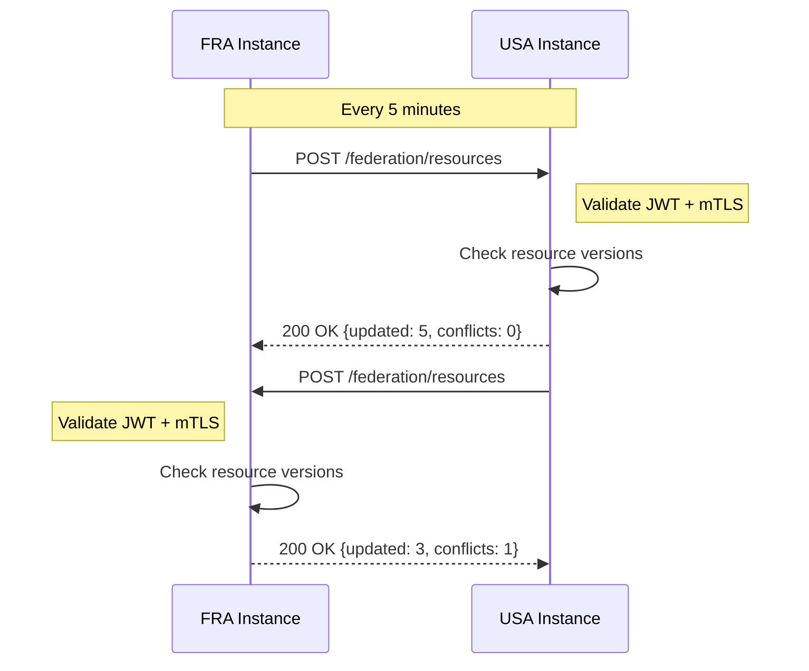

# FRA Instance Architecture Brief
**Version:** 1.0  
**Date:** November 24, 2025  
**Classification:** UNCLASSIFIED // FOR OFFICIAL USE ONLY

## Executive Summary

This document outlines the architecture for deploying a dedicated France (FRA) instance of DIVE V3, establishing the pattern for multi-realm federation across coalition partners. The FRA deployment serves as the template for subsequent partner onboarding (DEU, etc.) and validates the production-grade federation architecture.

## Architecture Overview

### Deployment Model: Segregated Multi-Tenant

```
┌─────────────────────────────────────────────────────────────┐
│                   Cloudflare Zero Trust                      │
│  ┌──────────────────────────────────────────────────────┐   │
│  │            FRA Instance (dive-v3-fra tunnel)         │   │
│  │  ┌─────────────────┐  ┌─────────────────┐          │   │
│  │  │   fra-app.      │  │   fra-api.      │          │   │
│  │  │   dive25.com    │  │   dive25.com    │          │   │
│  │  └────────┬────────┘  └────────┬────────┘          │   │
│  │           │                     │                    │   │
│  │  ┌────────▼─────────────────────▼─────────┐        │   │
│  │  │         FRA Docker Stack                │        │   │
│  │  │  ┌──────────┐ ┌──────────┐ ┌────────┐ │        │   │
│  │  │  │ Next.js  │ │ Backend  │ │  OPA   │ │        │   │
│  │  │  │ (3000)   │ │ (4000)   │ │ (8181) │ │        │   │
│  │  │  └──────────┘ └──────────┘ └────────┘ │        │   │
│  │  │  ┌──────────┐ ┌──────────┐ ┌────────┐ │        │   │
│  │  │  │ Keycloak │ │ MongoDB  │ │  KAS   │ │        │   │
│  │  │  │ (8443)   │ │ (27017)  │ │ (8080) │ │        │   │
│  │  │  └──────────┘ └──────────┘ └────────┘ │        │   │
│  │  └─────────────────────────────────────────┘        │   │
│  │                                                      │   │
│  │  fra-idp.dive25.com   fra-kas.dive25.com           │   │
│  └──────────────────────────────────────────────────────┘   │
│                              │                               │
│                    Federation Trust Link                     │
│                              │                               │
│  ┌──────────────────────────▼────────────────────────────┐  │
│  │            USA Instance (dive-v3-usa tunnel)          │  │
│  │     dev-app.dive25.com (existing deployment)          │  │
│  └────────────────────────────────────────────────────────┘  │
└───────────────────────────────────────────────────────────────┘
```

## Network Architecture

### Public Endpoints (via Cloudflare)

| Service | Hostname | Purpose | Access Control |
|---------|----------|---------|----------------|
| Frontend | fra-app.dive25.com | FRA UI | Cloudflare Access |
| API | fra-api.dive25.com | FRA Backend | Cloudflare Access + JWT |
| Keycloak | fra-idp.dive25.com | FRA IdP | Cloudflare Access |
| KAS | fra-kas.dive25.com | Key Service | Cloudflare Access + mTLS |

### Internal Services (Docker Network)

| Service | Internal Host | Port | Network |
|---------|--------------|------|---------|
| Next.js | frontend-fra | 3000 | dive-fra-network |
| Backend | backend-fra | 4000 | dive-fra-network |
| Keycloak | keycloak-fra | 8443 | dive-fra-network |
| OPA | opa-fra | 8181 | dive-fra-network |
| MongoDB | mongodb-fra | 27017 | dive-fra-network |
| KAS | kas-fra | 8080 | dive-fra-network |

## Security Architecture

### Trust Boundaries

1. **External Trust (Cloudflare)**
   - Service Tokens for API access
   - Access policies per hostname
   - mTLS for KAS endpoints
   - Rate limiting and DDoS protection

2. **Realm Trust (Keycloak)**
   - `dive-v3-broker-fra` realm isolation
   - JWKS rotation (quarterly)
   - Client credentials per partner
   - Backchannel logout support

3. **Service Trust (Internal)**
   - Docker network isolation
   - Service-to-service mTLS (KAS)
   - JWT validation at PEP
   - OPA policy enforcement

### Certificate Architecture

```yaml
Root CAs:
  - DIVE Coalition Root CA (RSA/ECC)
    └── FRA Intermediate CA
        ├── fra-idp.dive25.com (TLS)
        ├── fra-kas.dive25.com (TLS)
        └── fra-federation (mTLS client)

Trust Stores:
  - FRA: Trusts DIVE Root + USA Intermediate
  - USA: Trusts DIVE Root + FRA Intermediate
  - Rotation: Annual (intermediates), 5 years (root)
```

## Data Architecture

### Resource Namespacing

```typescript
interface FRAResource {
  resourceId: string;      // Format: "FRA-{uuid}"
  originRealm: "FRA";       // Fixed value
  version: number;          // Increments on update
  lastModified: Date;       // UTC timestamp
  syncStatus: {
    usa: { synced: boolean; timestamp: Date };
    deu: { synced: boolean; timestamp: Date };
  };
}
```

### Metadata Synchronization

```
┌─────────────┐     HTTPS/mTLS     ┌─────────────┐
│  FRA MongoDB├──────────────────►│  USA MongoDB │
│  (Primary)  │    POST /federation │  (Replica)   │
└─────────────┘     /resources     └─────────────┘
     │                                     │
     │         Conflict Resolution:        │
     │         - Origin realm wins         │
     │         - Version comparison        │
     └─────────────────────────────────────┘
```

## Keycloak Configuration

### Realm Structure

```yaml
dive-v3-broker-fra:
  display_name: "DIVE V3 - France Instance"
  internationalization:
    supported: ["fr", "en"]
    default: "fr"
  
  token_lifespans:
    access: 30m         # ANSSI RGS Level 2
    refresh: 12h        # France preference
    sso_idle: 30m
    sso_max: 12h
  
  password_policy: |
    upperCase(1) and lowerCase(1) and 
    digits(1) and specialChars(1) and length(12)
  
  webauthn_policy:
    rp_id: "fra.dive25.com"    # Subdomain specific
    user_verification: "preferred"
    attestation: "none"
```

### Claim Normalization

```javascript
// French → NATO Clearance Mapping
const CLEARANCE_MAP = {
  "CONFIDENTIEL_DEFENSE": "CONFIDENTIAL",
  "SECRET_DEFENSE": "SECRET",
  "TRES_SECRET_DEFENSE": "TOP_SECRET",
  "NON_PROTEGE": "UNCLASSIFIED"
};

// French COI Mapping
const COI_MAP = {
  "OTAN_COSMIQUE": "NATO-COSMIC",
  "UE_CONFIDENTIEL": "EU-CONFIDENTIAL"
};
```

## Federation Protocol

### Resource Exchange



### Decision Log Sharing

```json
{
  "timestamp": "2025-11-24T10:00:00Z",
  "originRealm": "FRA",
  "requestId": "req-fra-123",
  "subject": "pierre.dubois",
  "resource": "FRA-doc-456",
  "decision": "ALLOW",
  "evaluation": {
    "clearance": "PASS",
    "releasability": "PASS",
    "coi": "PASS"
  },
  "signature": "RS256(payload)"
}
```

## Infrastructure Specifications

### Compute Requirements

| Component | CPU | RAM | Storage | Notes |
|-----------|-----|-----|---------|-------|
| Docker Host | 4 vCPU | 8GB | 100GB SSD | Can scale horizontally |
| Keycloak | 2 vCPU | 4GB | - | Stateless, DB backend |
| MongoDB | 1 vCPU | 2GB | 50GB | Persistent volume |
| Next.js | 1 vCPU | 1GB | - | CDN for static assets |
| Backend | 1 vCPU | 1GB | - | Scales with load |
| OPA | 0.5 vCPU | 512MB | - | Decision cache enabled |
| KAS | 0.5 vCPU | 512MB | - | Key cache in Redis |

### Network Requirements

- **Bandwidth**: 10 Mbps sustained, 100 Mbps burst
- **Latency**: < 100ms to Cloudflare edge
- **Availability**: 99.5% SLA (43 hours downtime/year)

## Deployment Configuration

### Environment Variables

```bash
# FRA Instance Specific
INSTANCE_ID=fra
INSTANCE_REALM=dive-v3-broker-fra
INSTANCE_DOMAIN=fra.dive25.com

# Cloudflare Tunnel
CF_TUNNEL_NAME=dive-v3-fra
CF_TUNNEL_TOKEN=${CF_FRA_TUNNEL_TOKEN}
CF_ACCESS_CLIENT_ID=${CF_FRA_ACCESS_CLIENT_ID}
CF_ACCESS_CLIENT_SECRET=${CF_FRA_ACCESS_CLIENT_SECRET}

# Federation Trust
USA_FEDERATION_ENDPOINT=https://dev-api.dive25.com/federation
USA_FEDERATION_CLIENT_ID=${USA_FRA_CLIENT_ID}
USA_FEDERATION_CLIENT_SECRET=${USA_FRA_CLIENT_SECRET}
USA_JWKS_URL=https://dev-auth.dive25.com/realms/dive-v3-broker/protocol/openid-connect/certs

# Keycloak
KC_HOSTNAME=fra-idp.dive25.com
KC_HOSTNAME_STRICT=true
KC_PROXY=edge
```

### Docker Compose Structure

```yaml
# docker-compose.fra.yml
version: '3.8'

services:
  keycloak-fra:
    image: quay.io/keycloak/keycloak:26.0
    container_name: dive-v3-keycloak-fra
    hostname: keycloak-fra
    networks:
      - dive-fra-network
    volumes:
      - ./keycloak/fra-realm.json:/opt/keycloak/data/import/fra-realm.json
      - ./certs/fra:/opt/keycloak/certs
    environment:
      KC_HOSTNAME: fra-idp.dive25.com
      KC_REALM_NAME: dive-v3-broker-fra
      # ... other config

networks:
  dive-fra-network:
    name: dive-fra-network
    driver: bridge
    ipam:
      config:
        - subnet: 172.19.0.0/16  # Different from USA (172.18.0.0/16)
```

## Success Criteria

### Phase 1 Deliverables
- [x] Architecture brief (this document)
- [ ] Risk register with mitigation plans
- [ ] Gap coverage matrix
- [ ] SMART goals per phase
- [ ] GitHub commit of planning docs

### Metrics
- **Documentation Coverage**: 100% of architecture decisions documented
- **Risk Identification**: All critical risks identified with mitigations
- **Gap Mapping**: 100% of identified gaps mapped to remediation tasks

## References

- DIVE V3 Requirements: `/docs/dive-v3-requirements.md`
- Federation Guide: `/docs/KEYCLOAK-FEDERATION-GUIDE.md`
- Cloudflare Tunnel Docs: https://developers.cloudflare.com/cloudflare-one/connections/connect-apps/
- ANSSI RGS: https://www.ssi.gouv.fr/administration/reglementation/confiance-numerique/le-referentiel-general-de-securite-rgs/

## Approval

| Role | Name | Date | Signature |
|------|------|------|-----------|
| Technical Lead | | | |
| Security Officer | | | |
| FRA Representative | | | |

---
*End of Architecture Brief*


