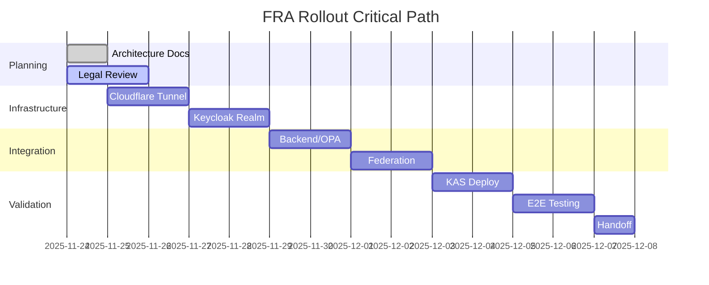

# FRA Rollout Implementation Plan with SMART Goals
**Version:** 1.0  
**Date:** November 24, 2025  
**Classification:** UNCLASSIFIED // FOR OFFICIAL USE ONLY

## Implementation Overview

**Project:** DIVE V3 France (FRA) Instance Deployment  
**Duration:** 8 days (November 24 - December 1, 2025)  
**Objective:** Deploy production-grade FRA instance proving multi-realm federation pattern for coalition partners

## SMART Goals Framework

**S**pecific - Clear, unambiguous deliverables  
**M**easurable - Quantifiable success criteria  
**A**chievable - Realistic with available resources  
**R**elevant - Aligned with federation objectives  
**T**ime-bound - Fixed deadlines per phase

---

## Phase 1: Planning & Baseline
**Duration:** Day 0-1 (Nov 24-25)  
**Status:** IN PROGRESS

### SMART Goals

#### Goal 1.1: Complete Architecture Documentation
- **Specific:** Create architecture brief, risk register, gap matrix
- **Measurable:** 3 documents completed and reviewed
- **Achievable:** Templates exist, 1 day sufficient
- **Relevant:** Foundation for all subsequent work
- **Time-bound:** Complete by Nov 24 EOD

#### Goal 1.2: Legal Compliance Review
- **Specific:** Review French data residency laws (GDPR, ANSSI)
- **Measurable:** Legal opinion document on data flows
- **Achievable:** Legal team engaged, materials ready
- **Relevant:** Blocks Phase 5 if not complete
- **Time-bound:** Complete by Nov 25 12:00 UTC

#### Goal 1.3: GitHub Repository Setup
- **Specific:** Commit planning docs, create FRA branch
- **Measurable:** CI pipeline passes, docs accessible
- **Achievable:** GitHub CLI access confirmed
- **Relevant:** Version control for all changes
- **Time-bound:** Complete by Nov 24 EOD

### Deliverables
- [x] Architecture Brief (`PHASE1-FRA-ARCHITECTURE-BRIEF.md`)
- [x] Risk Register (`PHASE1-RISK-REGISTER.md`)
- [x] Gap Coverage Matrix (`PHASE1-GAP-COVERAGE-MATRIX.md`)
- [x] Implementation Plan (`PHASE1-IMPLEMENTATION-PLAN.md`)
- [ ] Legal compliance memo
- [ ] GitHub commit with CI green

### Success Criteria
- All documents peer-reviewed
- No critical gaps without mitigation plan
- Legal sign-off on data handling

### Tests
- Documentation linting passes
- Markdown link validation
- CI/CD pipeline status check

---

## Phase 2: Cloudflare Zero Trust & Networking
**Duration:** Day 1-2 (Nov 25-26)  
**Status:** PENDING

### SMART Goals

#### Goal 2.1: Provision FRA Cloudflare Tunnel
- **Specific:** Create `dive-v3-fra` tunnel with 4 hostnames
- **Measurable:** All endpoints responding 200 OK
- **Achievable:** Script exists, API access confirmed
- **Relevant:** Network foundation for FRA
- **Time-bound:** Complete by Nov 25 18:00 UTC

#### Goal 2.2: Implement High Availability
- **Specific:** Deploy primary + standby tunnels
- **Measurable:** Failover < 30 seconds
- **Achievable:** Cloudflare supports multiple tunnels
- **Relevant:** Addresses GAP-006 (SPOF risk)
- **Time-bound:** Complete by Nov 26 12:00 UTC

#### Goal 2.3: Configure Zero Trust Access
- **Specific:** Create service tokens, Access policies
- **Measurable:** Unauthorized returns 403, authorized 200
- **Achievable:** Templates from USA instance
- **Relevant:** Security boundary enforcement
- **Time-bound:** Complete by Nov 26 18:00 UTC

### Deliverables
- [ ] Tunnel configuration (`~/.cloudflared/fra/config.yml`)
- [ ] DNS records (fra-app, fra-api, fra-idp, fra-kas)
- [ ] Access policies per service
- [ ] Service token rotation schedule
- [ ] Health check dashboard

### Success Criteria
- All hostnames resolve globally
- Access enforcement validated
- Failover tested successfully
- Monitoring alerts configured

### Tests
```bash
# Tunnel connectivity
curl https://fra-app.dive25.com/health
curl https://fra-api.dive25.com/health
curl https://fra-idp.dive25.com/health

# Access enforcement
curl -H "CF-Access-Client-Id: XXX" https://fra-api.dive25.com
curl https://fra-api.dive25.com  # Should fail

# Failover test
cloudflared tunnel stop dive-v3-fra-primary
# Verify < 30s recovery
```

---

## Phase 3: Keycloak Realm Configuration
**Duration:** Day 2-3 (Nov 26-27)  
**Status:** PENDING

### SMART Goals

#### Goal 3.1: Deploy dive-v3-broker-fra Realm
- **Specific:** Clone and customize FRA realm in Keycloak
- **Measurable:** Realm accessible at fra-idp.dive25.com
- **Achievable:** Terraform configs exist
- **Relevant:** Identity foundation for FRA
- **Time-bound:** Complete by Nov 26 EOD

#### Goal 3.2: Implement Attribute Normalization
- **Specific:** Map French clearance terms to NATO standard
- **Measurable:** 100% test coverage for mappings
- **Achievable:** Mapping table defined
- **Relevant:** Addresses GAP-002
- **Time-bound:** Complete by Nov 27 12:00 UTC

#### Goal 3.3: Configure Federation Trust
- **Specific:** Establish OIDC trust with USA broker
- **Measurable:** Successful token exchange
- **Achievable:** Protocol documented
- **Relevant:** Core federation requirement
- **Time-bound:** Complete by Nov 27 18:00 UTC

### Deliverables
- [ ] Realm export (`fra-realm.json`)
- [ ] Attribute mappers configuration
- [ ] Test user accounts (3 clearance levels)
- [ ] JWKS rotation schedule
- [ ] Federation trust certificates

### Success Criteria
- French user can authenticate
- Attributes correctly normalized
- Token validated by USA instance
- AAL levels properly mapped

### Tests
```bash
# Realm health
curl https://fra-idp.dive25.com/realms/dive-v3-broker-fra/.well-known/openid-configuration

# Attribute mapping test
./scripts/test-fra-clearance-mapping.sh

# Federation test
./scripts/test-fra-usa-federation.sh
```

---

## Phase 4: Backend & OPA Integration
**Duration:** Day 3-4 (Nov 27-28)  
**Status:** PENDING

### SMART Goals

#### Goal 4.1: Deploy FRA Backend Services
- **Specific:** Backend, OPA, MongoDB for FRA instance
- **Measurable:** All health checks passing
- **Achievable:** Docker compose ready
- **Relevant:** Application layer
- **Time-bound:** Complete by Nov 27 EOD

#### Goal 4.2: Configure Authorization Policies
- **Specific:** OPA policies with French clearance support
- **Measurable:** 41+ policy tests passing
- **Achievable:** Base policies exist
- **Relevant:** Authorization enforcement
- **Time-bound:** Complete by Nov 28 12:00 UTC

#### Goal 4.3: Implement Correlation IDs
- **Specific:** X-Request-ID in all operations
- **Measurable:** IDs present in 100% of logs
- **Achievable:** Middleware pattern exists
- **Relevant:** Addresses GAP-004
- **Time-bound:** Complete by Nov 28 18:00 UTC

### Deliverables
- [ ] docker-compose.fra.yml
- [ ] Environment configuration (.env.fra)
- [ ] OPA policy bundle with French support
- [ ] MongoDB indexes and schemas
- [ ] Correlation ID middleware

### Success Criteria
- Backend API responds at fra-api.dive25.com
- OPA decisions logged with correlation
- MongoDB isolated from USA instance
- Integration tests passing

### Tests
```bash
# Backend health
npm run test:backend

# OPA validation
opa test policies/fra/

# Integration
npm run test:integration:fra
```

---

## Phase 5: Metadata Federation
**Duration:** Day 4-5 (Nov 28-29)  
**Status:** PENDING

### SMART Goals

#### Goal 5.1: Implement Resource Namespacing
- **Specific:** FRA- prefix for all French resources
- **Measurable:** 100% resources have prefix
- **Achievable:** Validation in place
- **Relevant:** Addresses GAP-003
- **Time-bound:** Complete by Nov 28 EOD

#### Goal 5.2: Deploy Federation Endpoints
- **Specific:** /federation/resources, /federation/decisions
- **Measurable:** Bidirectional sync working
- **Achievable:** API spec defined
- **Relevant:** Core federation capability
- **Time-bound:** Complete by Nov 29 12:00 UTC

#### Goal 5.3: Configure Sync Schedule
- **Specific:** 5-minute automated sync with conflict resolution
- **Measurable:** < 1% sync failures
- **Achievable:** Cron pattern established
- **Relevant:** Data consistency
- **Time-bound:** Complete by Nov 29 18:00 UTC

### Deliverables
- [ ] Resource seeding script (100 FRA resources)
- [ ] Federation API implementation
- [ ] Sync scheduler configuration
- [ ] Conflict resolution logic
- [ ] Data residency filters

### Success Criteria
- FRA resources visible in USA
- USA resources (releasable to FRA) visible in FRA
- Version conflicts detected and resolved
- Sync metrics dashboard operational

### Tests
```bash
# Resource validation
./scripts/validate-fra-resources.sh

# Federation sync
./scripts/test-federation-sync.sh

# Conflict resolution
./scripts/test-conflict-resolution.sh
```

---

## Phase 6: FRA KAS Deployment
**Duration:** Day 5-6 (Nov 29-30)  
**Status:** PENDING

### SMART Goals

#### Goal 6.1: Deploy FRA KAS Service
- **Specific:** KAS at fra-kas.dive25.com with key namespace
- **Measurable:** Service responding, keys isolated
- **Achievable:** KAS codebase ready
- **Relevant:** Encryption support
- **Time-bound:** Complete by Nov 29 EOD

#### Goal 6.2: Implement Authority Protocol
- **Specific:** Origin realm KAS is authoritative
- **Measurable:** 100% correct authority decisions
- **Achievable:** Logic documented
- **Relevant:** Addresses GAP-005
- **Time-bound:** Complete by Nov 30 12:00 UTC

#### Goal 6.3: Deploy Mismatch Detection
- **Specific:** Alert on KAS/PDP divergence
- **Measurable:** Alerts within 1 minute
- **Achievable:** Monitoring exists
- **Relevant:** Security compliance
- **Time-bound:** Complete by Nov 30 18:00 UTC

### Deliverables
- [ ] KAS deployment configuration
- [ ] Key namespace implementation
- [ ] Authority decision logic
- [ ] Mismatch alert rules
- [ ] Cross-realm key tests

### Success Criteria
- Encrypted FRA resource accessible
- Authority correctly determined
- Mismatches logged and alerted
- Performance < 200ms p95

### Tests
```bash
# KAS health
curl https://fra-kas.dive25.com/health

# Authority test
./scripts/test-kas-authority.sh

# Mismatch detection
./scripts/test-kas-mismatch.sh
```

---

## Phase 7: End-to-End Validation
**Duration:** Day 6-7 (Nov 30 - Dec 1)  
**Status:** PENDING

### SMART Goals

#### Goal 7.1: Execute E2E Test Suite
- **Specific:** All user flows for FRA↔USA federation
- **Measurable:** 100% scenarios passing
- **Achievable:** Test suite prepared
- **Relevant:** Production readiness
- **Time-bound:** Complete by Nov 30 EOD

#### Goal 7.2: Conduct Failover Testing
- **Specific:** Simulate tunnel, service outages
- **Measurable:** Recovery < SLA targets
- **Achievable:** Failure injection ready
- **Relevant:** Availability validation
- **Time-bound:** Complete by Dec 1 12:00 UTC

#### Goal 7.3: Complete Documentation
- **Specific:** Runbooks, architecture diagrams
- **Measurable:** All sections complete
- **Achievable:** Templates exist
- **Relevant:** Operational handoff
- **Time-bound:** Complete by Dec 1 18:00 UTC

### Deliverables
- [ ] E2E test results report
- [ ] Performance benchmarks
- [ ] Failover test results
- [ ] Updated documentation
- [ ] Incident response playbook

### Success Criteria
- All E2E scenarios pass
- Performance meets SLAs
- Documentation reviewed and approved
- No critical issues outstanding

### Tests
```bash
# Full E2E suite
npm run test:e2e:fra

# Performance
npm run benchmark:fra

# Chaos engineering
./scripts/chaos-test-fra.sh
```

---

## Phase 8: Handoff Preparation
**Duration:** Day 7-8 (Dec 1)  
**Status:** PENDING

### SMART Goals

#### Goal 8.1: Package Deployment Kit
- **Specific:** Scripts, configs for DEU onboarding
- **Measurable:** DEU deployment < 4 hours
- **Achievable:** Parameterized scripts
- **Relevant:** Scalability demonstration
- **Time-bound:** Complete by Dec 1 14:00 UTC

#### Goal 8.2: Verify CI/CD Pipeline
- **Specific:** All GitHub Actions passing
- **Measurable:** 100% green status
- **Achievable:** Fixes documented
- **Relevant:** Continuous deployment
- **Time-bound:** Complete by Dec 1 16:00 UTC

#### Goal 8.3: Create Executive Summary
- **Specific:** Lessons learned, recommendations
- **Measurable:** 5-page summary
- **Achievable:** Data collected
- **Relevant:** Strategic decisions
- **Time-bound:** Complete by Dec 1 18:00 UTC

### Deliverables
- [ ] Deployment kit (scripts, configs, docs)
- [ ] CI/CD status report
- [ ] Executive summary
- [ ] Lessons learned document
- [ ] DEU onboarding guide

### Success Criteria
- Deployment kit tested
- CI/CD fully green
- Documentation approved
- Handoff accepted

### Tests
```bash
# Deployment kit validation
./scripts/validate-deployment-kit.sh

# CI/CD check
gh workflow run ci --ref fra-rollout

# Documentation lint
npm run lint:docs
```

---

## Critical Path



## Risk Mitigation Checkpoints

### Phase Gates (Go/No-Go Decisions)

**Gate 1 (Post-Planning):** Legal clearance on data handling  
**Gate 2 (Post-Cloudflare):** Network connectivity validated  
**Gate 3 (Post-Keycloak):** Authentication functional  
**Gate 4 (Post-Backend):** Authorization working  
**Gate 5 (Post-Federation):** Bidirectional sync confirmed  
**Gate 6 (Post-KAS):** Encryption operational  
**Gate 7 (Post-E2E):** All tests passing  

## Daily Standup Agenda

1. **Yesterday:** Completed tasks and tests
2. **Today:** Current phase goals
3. **Blockers:** Issues requiring escalation
4. **Gaps:** New discoveries or risks
5. **Metrics:** Progress against SMART goals

## Success Metrics Dashboard

| Phase | Goals | Completed | Tests | Passed | Gaps Closed | Status |
|-------|-------|-----------|-------|--------|-------------|--------|
| 1 | 3 | 2 | 3 | 0 | 1 | 🟡 In Progress |
| 2 | 3 | 0 | 5 | 0 | 4 | ⏸️ Pending |
| 3 | 3 | 0 | 4 | 0 | 3 | ⏸️ Pending |
| 4 | 3 | 0 | 3 | 0 | 2 | ⏸️ Pending |
| 5 | 3 | 0 | 3 | 0 | 4 | ⏸️ Pending |
| 6 | 3 | 0 | 3 | 0 | 3 | ⏸️ Pending |
| 7 | 3 | 0 | 4 | 0 | 2 | ⏸️ Pending |
| 8 | 3 | 0 | 3 | 0 | 0 | ⏸️ Pending |

## Communication Plan

### Stakeholder Updates
- **Daily:** Slack status in #dive-v3-fra
- **Phase Completion:** Email to stakeholders
- **Issues:** Immediate escalation via phone

### Documentation
- **Real-time:** Update this plan daily
- **Phase Docs:** Complete before moving on
- **Final Report:** Comprehensive summary

## Contingency Plans

### Schedule Slippage
- **1 day:** Compress Phase 8 (handoff)
- **2 days:** Defer KAS to post-deployment
- **3+ days:** Escalate to management

### Technical Blockers
- **Cloudflare:** Fallback to direct routing
- **Keycloak:** Use manual configuration
- **Federation:** Async batch mode

### Resource Unavailability
- **Primary:** Documented handoff procedures
- **Secondary:** Cross-trained team members
- **Emergency:** Vendor support contracts

---

## Approval and Sign-off

| Role | Name | Approval | Date |
|------|------|----------|------|
| Project Manager | | ☐ | |
| Technical Lead | | ☐ | |
| Security Officer | | ☐ | |
| FRA Representative | | ☐ | |

---
*End of Implementation Plan*


